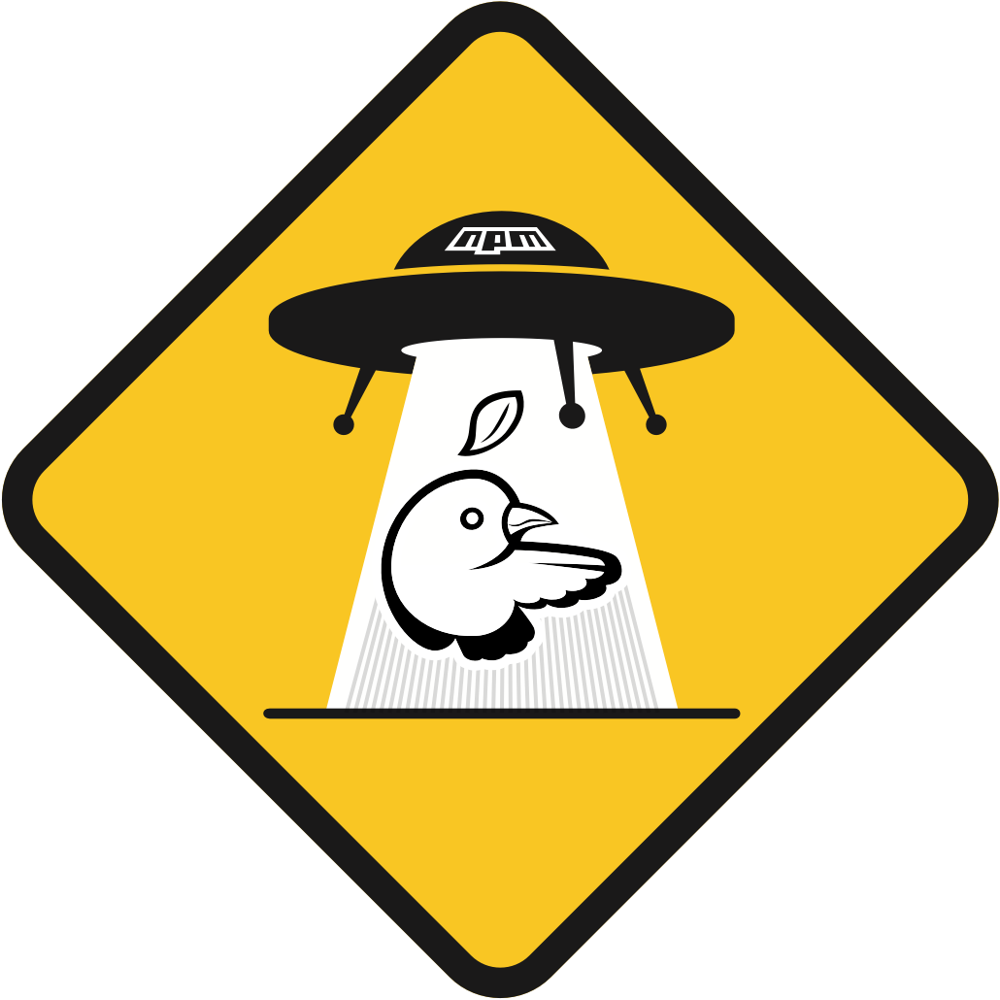

<p align="center"></p>
<h1 align="center">grunt-npm-bower</h1>
<div align="center">
<a href="https://travis-ci.org/wireapp/grunt-npm-bower?branch=master"></a>
<a href="https://www.npmjs.com/package/grunt-npm-bower"></a>
</div>

# Wire

This repository is part of the source code of Wire. You can find more information at [wire.com](https://wire.com) or by contacting opensource@wire.com.

You can find the published source code at [github.com/wireapp](https://github.com/wireapp).

For licensing information, see the attached LICENSE file and the list of third-party licenses at [wire.com/legal/licenses/](https://wire.com/legal/licenses/).

## Description

Grunt plugin which helps migrating from [Bower](https://bower.io) to [npm](https://www.npmjs.com).

## Installation

```bash
npm install --save-dev grunt-npm-bower
```

```javascript
grunt.loadNpmTasks('grunt-npm-bower');
```

## Workflow

Using [grunt-npm-bower](https://github.com/wireapp/grunt-npm-bower) is as simple as this:

1. Run [bower-away](https://github.com/sheerun/bower-away) command in the project you want to migrate (but don't delete your `bower.json` yet!).
2. Run [grunt-npm-bower](https://github.com/wireapp/grunt-npm-bower) task (from your `Gruntfile.js`)
3. Finally, delete your `bower.json` (☠)

An exemplary task configuration:

**Gruntfile.js**

```javascript
module.exports = grunt => {
  grunt.initConfig({
    npmBower: {
      options: {
        cleanTargetDir: true,
        targetDir: './lib',
        verbose: true,
      }
  });

  grunt.loadNpmTasks('grunt-npm-bower');
  grunt.registerTask('default', ['bowerMigrate:npm']);
};
```

## Options

### `bowerConfig`

- Type: `String`
- Default: `bower.json`

Location of your Bower configuration (relative to your project's root directory).

### `componentDir`

- Type: `String`
- Default: `node_modules`

Location where your Bower components are installed. When using `bower install` this will be `bower_components`. If you are using `npm install` (or `yarn`), it's `node_modules`. If you are using a [.bowerrc](https://bower.io/docs/config/) file, it might be something else.

### `cleanTargetDir`

- Type: `Boolean`
- Default: `false`

If setted to `true`, the specified `targetDir` will be removed before copying Bower components there.

### `overrideProp`

- Type: `String`
- Default: `exportsOverride`

Key name that is being used for export overrides (if defined). Read more about `exportsOverride` in "[Advanced usage](https://github.com/yatskevich/grunt-bower-task#advanced-usage)". 

### `resolveName`

- Type: `Boolean`
- Default: `true`
 
If setted to `true`, the plugin tries to resolve the names of your dependencies from a `bower.json`, `.bower.json` or `package.json` file (in this order). If setted to `false`, it resolves the names from your `package.json` (Example: `@bower_components/dexie`).


